# Aixle

A procedural 3D modelling language written for language models to write.
A model is a short program: primitives, combined with constructive solid
geometry, transformed, repeated, blended and painted, each step named and
building on the last. One command turns the program into pictures an agent
can look at to check its work (a contact sheet of views, cross-sections,
one thumbnail per build step, a turntable) and into meshes it can ship
(OBJ with materials, binary glTF with baked colours).

```
# A coffee mug: a rounded cup, hollowed and opened at the top, a torus handle.
r = 1.2
body = cylinder(r=r, h=2.4, round=0.12)
cavity = cylinder(r - 0.14, 2.4) | move(0, 0.2, 0)
cup = body - cavity
handle = torus(0.75, 0.16) | rotate(x=90) | move(r + 0.45, 0.1, 0)
mug = (cup + handle) | paint("porcelain") | ground()
show mug
```

```
npx aixle render examples/mug.aix        # writes out/mug/
```

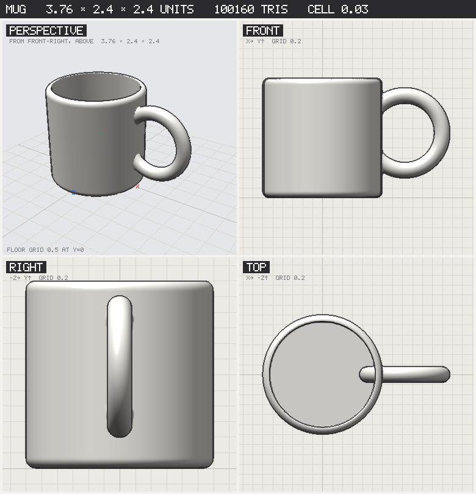

`--beauty` adds a ray-marched render of the field with soft shadows and
ambient occlusion, for the picture that shows the model as meant:

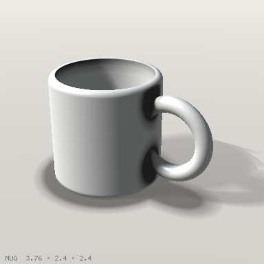

The cross-sections come straight from the distance field, so a hollow you
cannot see from outside is still checkable:

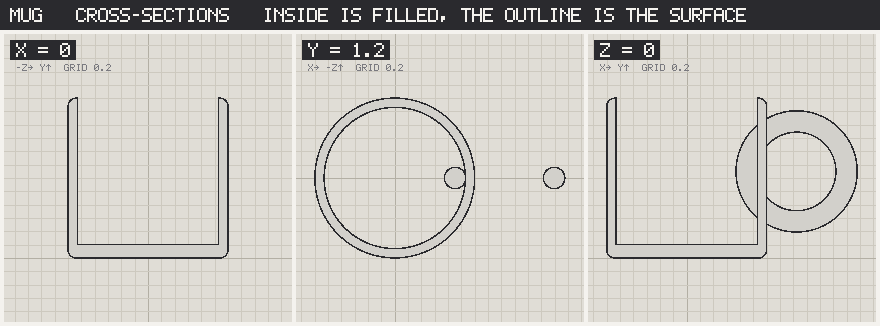

And every named shape gets a thumbnail, in program order, with its size; a
red frame means it never made it into the output:

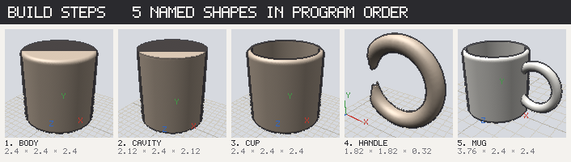

## Working with it

The loop an agent runs is: write a `.aix` file, `check` it, `render` it,
read `sheet.png`, compare against what was intended, fix, repeat.
[`docs/agent-guide.md`](docs/agent-guide.md) is the short version of that
loop with the checklist, and [`.claude/skills/aixle/SKILL.md`](.claude/skills/aixle/SKILL.md)
packages it as a Claude Code skill: copy that folder into another
project's `.claude/skills/` and `/aixle` brings the whole loop along.
[`docs/language.md`](docs/language.md) is the language guide and
[`docs/reference.md`](docs/reference.md) every function with its signature,
generated from the code so it cannot drift.

```
npm install
npx aixle check  model.aix           # parse, evaluate, print sizes, warnings and failed asserts; no pictures (--pose NAME for a rig's pose)
npx aixle explain model.aix          # the program as a tree from the output down, for a program someone else wrote
npx aixle render model.aix           # everything, into out/model/
npx aixle render model.aix --quick   # the sheet only, in a second or two; add --watch to re-render on save
npx aixle diff before.aix after.aix  # two versions side by side
npx aixle render model.aix --beauty         # plus beauty.png (a second or a few)
npx aixle render model.aix --azimuth 60 --elevation 10   # turn the camera
npx aixle render model.aix --focus lid --pose reach      # frame one part; show a rig in one pose
npx aixle render model.aix --grid 200 --size 768 --out somewhere
npx aixle render model.aix --crease 0           # one smooth normal per vertex; the default splits edges at 35 degrees
npx aixle render model.aix --minecraft 16       # also Minecraft Bedrock geometry (model.geo.json, model.geo.png; --minecraft-entity to face north)
npx aixle render model.aix --roblox             # also model.roblox.glb for Roblox Studio (facing -Z, _Att attachment nodes)
npx aixle doc                        # the reference, to stdout
```

`render` writes:

| File | What |
| --- | --- |
| `sheet.png` | perspective, front, right and top views on unit grids, with the model's size in the bar |
| `slices.png` | cross-sections on x, y and z, inside filled with the material, outline where the surface is |
| `steps.png` | one thumbnail per named shape in program order; red = not part of the output |
| `turntable.png` | eight views around the model |
| `persp.png`, `front.png`, `right.png`, `top.png` | the views on their own |
| `model.obj`, `model.mtl` | the mesh with UVs, one group per material, mapped to the atlas |
| `model.stl` | binary STL for a slicer: the model as shown, posed if a pose is set |
| `model.png` | the texture atlas: the procedural materials baked per chart |
| `model.glb` | binary glTF with the atlas embedded (`--no-texture` for vertex colours instead) |
| `viewer.html` | orbit the GLB in a browser and play its animations (loop, speed, scrub bar, all in turn): self-contained, loads three.js from a CDN |
| `beauty.png` | with `--beauty`: the field ray-marched with soft shadows and ambient occlusion |
| `poses.png`, `anim_<name>.png` | with joints: every pose, and frames through each animation |
| `model.roblox.glb` | with `--roblox`: the GLB for Roblox Studio's 3D Importer, a Handle node facing -Z with `_Att` attachment nodes from the anchors |
| `model.geo.json`, `model.geo.png` | with `--minecraft`: Bedrock geometry, the model voxelised at 16 pixels to the block and merged into cuboids, a bone per object and per joint, with its texture |
| `model.animation.json` | with `--minecraft` and joints: the animations as Bedrock keyframes on the joint bones |
| `report.md`, `report.json` | size, bounds, triangle count, mass, centre of mass, whether it stands, pieces, every step's size and whether it is used, warnings |

## The language in one screen

```
name = expr                      # every assignment is a step
def part(a, b=1) = expr          # a parametric part
for i in range(6) { ... }        # loops; also range(a, b), range(a, b, step), or a list [1, 2.5]
show name                        # what to output (default: the last shape)

box(w, h, d)  sphere(r)  cylinder(r, h)  cone(r1, r2, h)  capsule(r, h)  torus(R, r)  prism(sides, r, h)
circle(r)  rect(w, h)  ngon(n, r)  star(n, r1, r2)  polygon(x1,y1, ...)  text("Hi", size, arc=r)   # 2D
extrude(profile, h)  revolve(profile, angle=180)  loft(a, b, h)                          # to solids
tube(r, points, smooth=6, taper=1)  sweep(profile, points, smooth=6, twist=0, taper=1)   # along a path
helix(r, h, turns)  arc(r, from, to)  spline(points)                                     # point lists
bezier(points)  curve(points)  tube(r, c)  sweep(profile, c)  text("Ab", 1, face="serif")  # exact curves, serifs
import("part.obj", size=2)                                                               # a mesh as a shape
use "std/furniture" as f   f.chair(seat=0.45)   use "parts/mine.aix"   mine.bracket(0.2)   # libraries of defs
anchor(part, "tip", x, y, z)   at(part, "tip")   lamp | attach("bottom", arm, "tip")     # placement by name
scene a, b, c   place(shape, [x,y,z,yaw, ...])   joint(part, "elbow", x, y, z)          # assemblies
pose("reach", elbow=[0, 0, 40], hand=xform(move=[0, 0.2, 0], scale=1.1))   animation("wave", ["rest", "reach", "rest"], seconds=2, ease=1)
set light_size 2   set light_azimuth -40   set ambient 1.5   set dof 1   paint("glass")   # beauty render
decal(shape, region, "black")   material("#fc6", glow=1)   material("red", "stripes", axis="x")  # surface paint

a + b   a - b   a & b            # union, difference, intersection (also union(a, b, c, k=0.3) for smooth)
a | move(x, y, z) | rotate(y=45) | scale(2) | mirror("x")
  | round(r) | shell(t) | twist(deg) | bend(deg) | displace(amp, size)
  | array(n, dx, dy, dz) | grid(nx, nz, dx, dz) | ring(n, radius, axis="y")
  | ground() | center() | paint("wood")
```

Units are whatever you say they are; y is up; angles are degrees. Every
primitive is centred on the origin and stands along y. `a | f(x)` is
`f(a, x)`. Paint parts before combining them if they should keep different
materials.

The docs, the gallery and the dogfooding record are published at
[tyevco.github.io/aixle](https://tyevco.github.io/aixle/).

## Examples

[`examples/`](examples/) has eighteen models exercising the language, each
with its sheet, slices, steps and beauty render under
[`examples/renders/`](examples/renders/): a mug, a fluted vase from a
revolved profile, a teapot with a tube spout and a swept handle, a desk
lamp with a lofted shade, a reel of three-strand rope swept along a helix
with a twist, a hanging sign with raised and engraved text, a rock garden
from an imported mesh, a robot arm with three joints and a waving
animation, a fenced plot with placed panels and trees, a table with
parametric chairs, a brick tower, a pair of gears from 2D profiles, a
spiral staircase from a loop, a robot with per-part materials, a tree
with smooth blends and displacement, a glass tumbler for refraction and
depth of field, a medal with text on an arc and a partial revolve, and a
desk nameplate with serif lettering engraved in brass and scrolls swept
along exact Bezier curves.

| | | |
| --- | --- | --- |
| 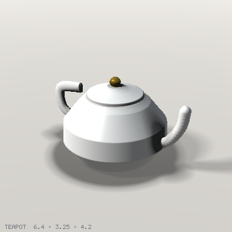 | 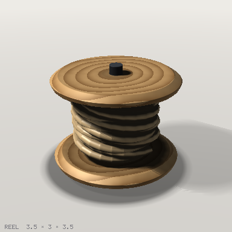 | 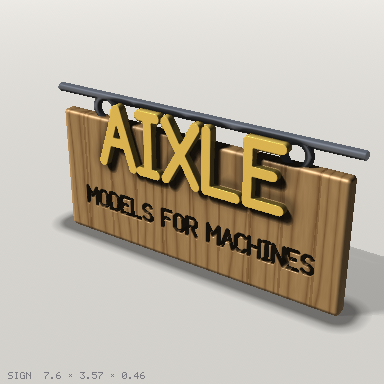 |
| 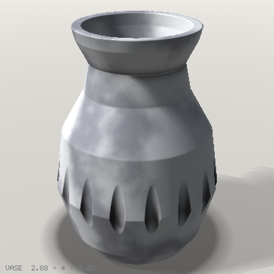 | 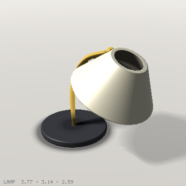 | 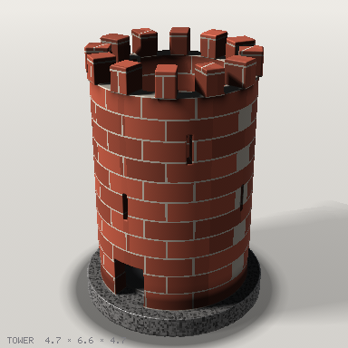 |
| 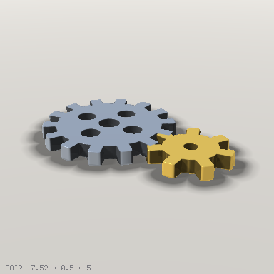 | 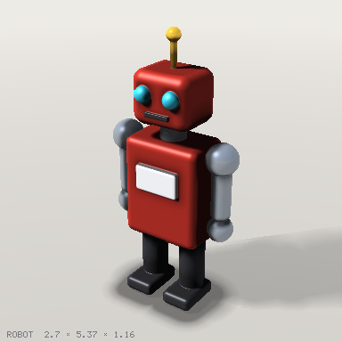 | 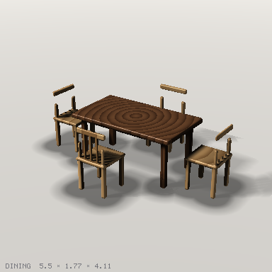 |
| 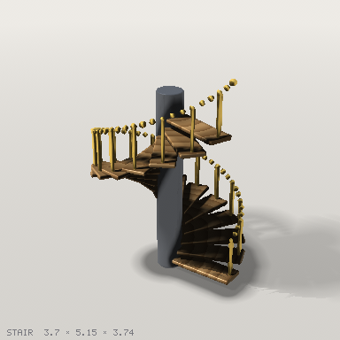 | 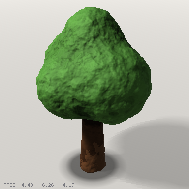 | 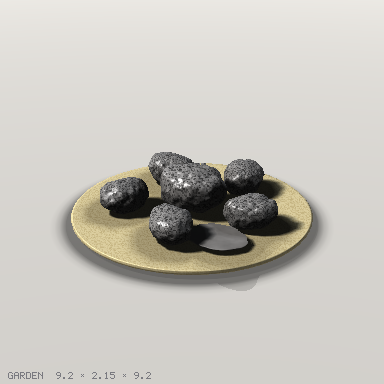 |
| 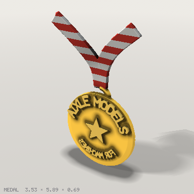 | 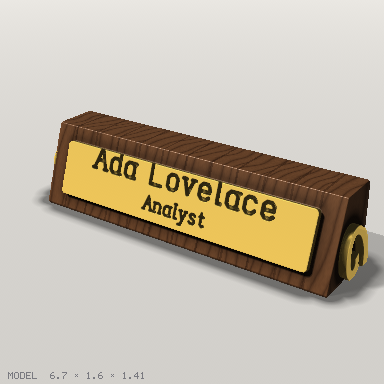 | 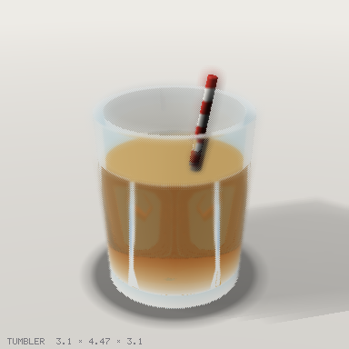 |
| 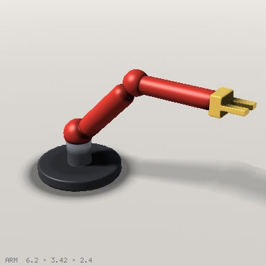 | 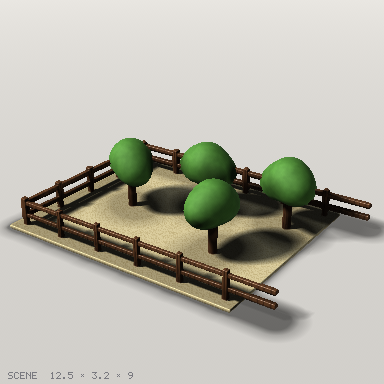 |  |

## How it works

Shapes are signed distance fields, not meshes. That is why the booleans are
exact and never fail on coincident faces, why `shell`, `round`, smooth
blends, `twist` and `displace` are one line each, and why a cross-section
is free. The surface is extracted once at the end by surface nets with
dual contouring on a grid (`--grid`, default 128 cells on the longest
side), so corners stay sharp, and that one mesh is what the software
rasteriser draws and what the exporters write, so the pictures show the
file you get. The beauty render marches the field itself, primed by that
mesh so it costs about a second. For the exports, the procedural materials
are baked into a texture atlas with UVs, so the GLB looks the same in an
engine as it does here. Materials are procedural patterns evaluated in the
painted part's own frame, sampled per pixel when rendering and per vertex
when exporting; there are no UVs. [`docs/design.md`](docs/design.md) has
the reasoning and the limits.

No runtime dependencies. `npm test` runs the unit tests; `npm run check`
runs typecheck, tests, the reference and the example renders, which CI
compares against the committed files.
