# Gallery

Every example and every dogfooding model, as the tool renders them: the
beauty render and the contact sheet, with the program that made it and a
viewer that orbits the mesh in the browser. The renders are the committed
ones, regenerated by CI from the programs; the viewers are built with the
site. This page is generated by `npm run pages:gallery`.

[[toc]]

## Examples

The worked models under `examples/`, each written to exercise a part of the language.

### arm

A robot arm with three joints. Each part is built in place, then declared

 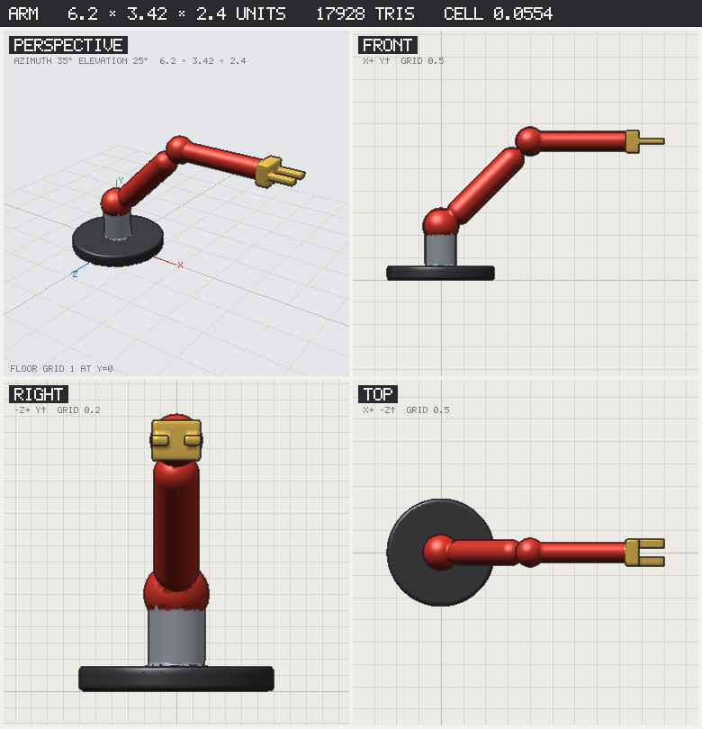

[program](https://github.com/tyevco/aixle/blob/main/examples/arm.aix) · <a href="/aixle/viewers/arm.html" target="_blank" rel="noopener">viewer</a>

### fence

A fenced plot with a row of trees: place() puts copies of one shape at

 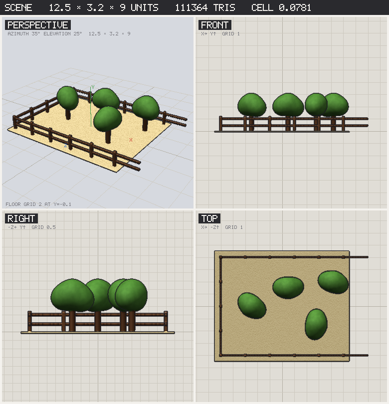

[program](https://github.com/tyevco/aixle/blob/main/examples/fence.aix) · <a href="/aixle/viewers/fence.html" target="_blank" rel="noopener">viewer</a>

### garden

A rock garden from an imported mesh: assets/rock.obj was itself made

 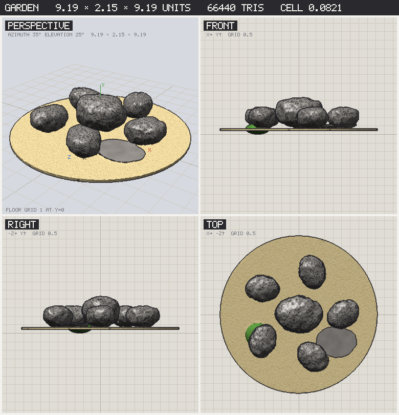

[program](https://github.com/tyevco/aixle/blob/main/examples/garden.aix) · <a href="/aixle/viewers/garden.html" target="_blank" rel="noopener">viewer</a>

### gear

A spur gear built as a 2D profile and extruded: a disc, teeth added in a

 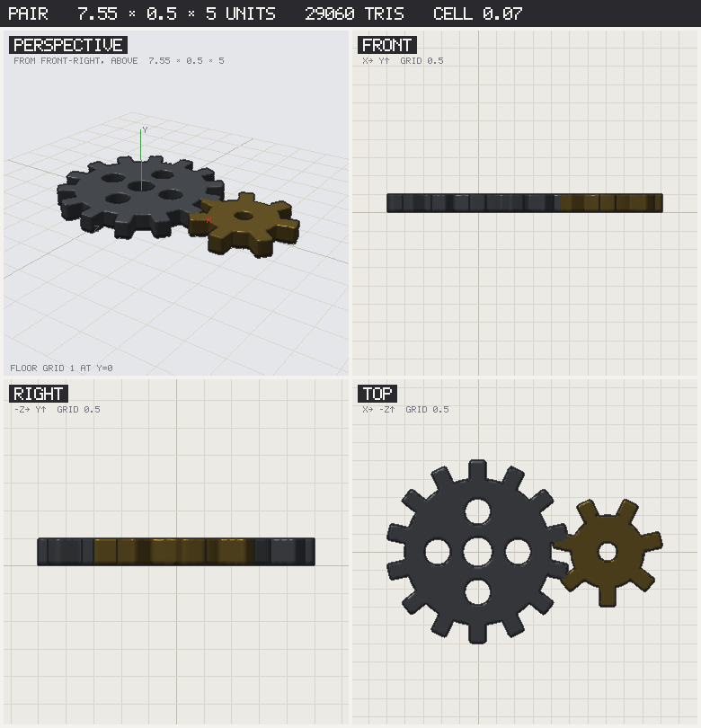

[program](https://github.com/tyevco/aixle/blob/main/examples/gear.aix) · <a href="/aixle/viewers/gear.html" target="_blank" rel="noopener">viewer</a>

### lamp

A desk lamp: a weighted base, an arm that is a tube bent through four

 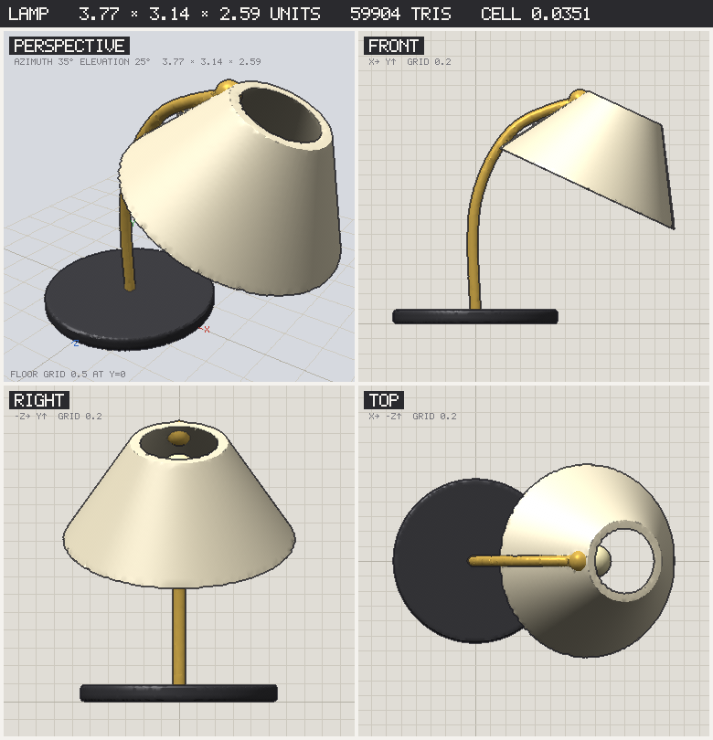

[program](https://github.com/tyevco/aixle/blob/main/examples/lamp.aix) · <a href="/aixle/viewers/lamp.html" target="_blank" rel="noopener">viewer</a>

### medal

A medal on a ribbon: text bent around the rim with arc=, a star in

 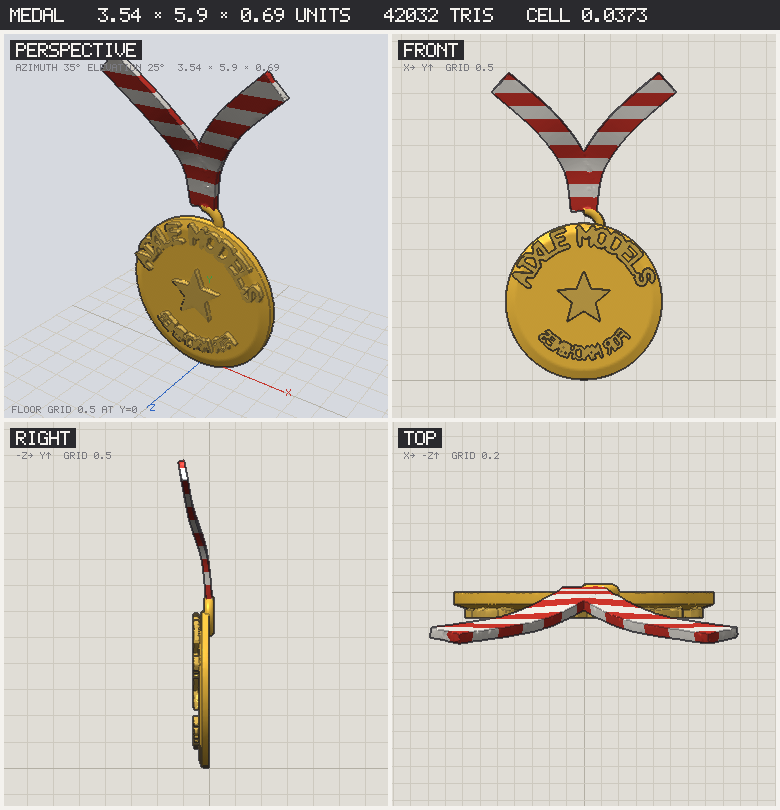

[program](https://github.com/tyevco/aixle/blob/main/examples/medal.aix) · <a href="/aixle/viewers/medal.html" target="_blank" rel="noopener">viewer</a>

### mug

A coffee mug: a rounded cup, hollowed and opened at the top, a torus handle.

 

[program](https://github.com/tyevco/aixle/blob/main/examples/mug.aix) · <a href="/aixle/viewers/mug.html" target="_blank" rel="noopener">viewer</a>

### nameplate

A desk nameplate: a walnut wedge with a brass plate on its leaning face,

 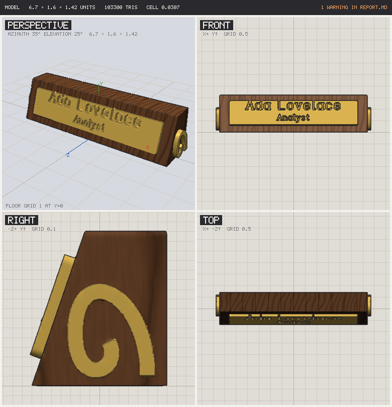

[program](https://github.com/tyevco/aixle/blob/main/examples/nameplate.aix) · <a href="/aixle/viewers/nameplate.html" target="_blank" rel="noopener">viewer</a>

### robot

A toy robot: mirror() builds both arms and legs from one side, and each

 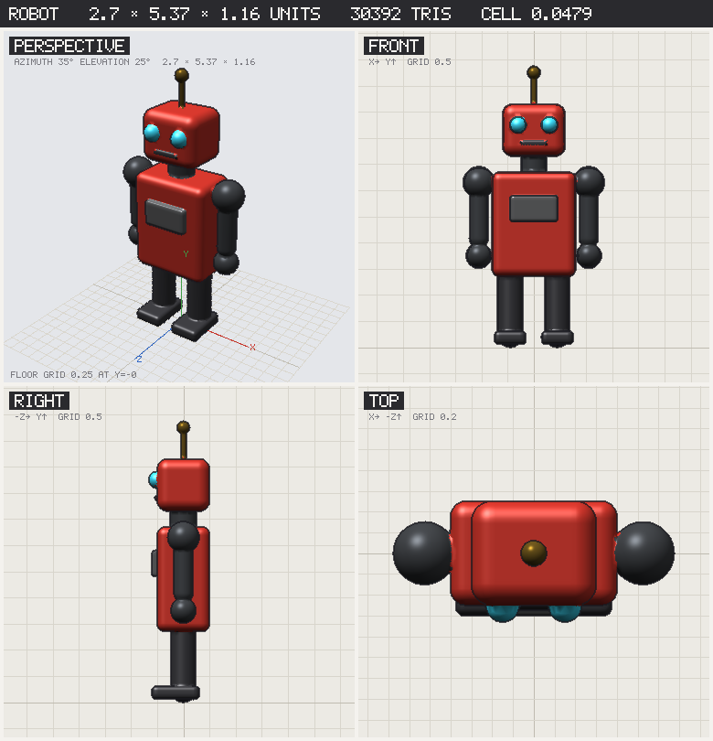

[program](https://github.com/tyevco/aixle/blob/main/examples/robot.aix) · <a href="/aixle/viewers/robot.html" target="_blank" rel="noopener">viewer</a>

### rope

A coil of rope on a wooden spool. The rope is three strands, each a

 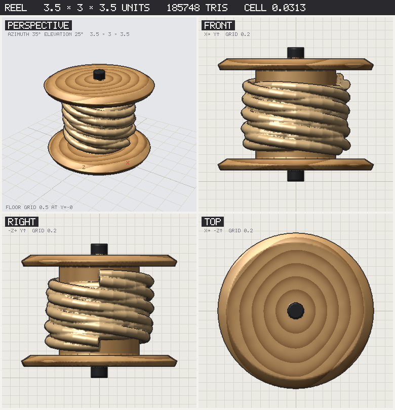

[program](https://github.com/tyevco/aixle/blob/main/examples/rope.aix) · <a href="/aixle/viewers/rope.html" target="_blank" rel="noopener">viewer</a>

### sign

A hanging sign: a rounded oak board with raised brass lettering, a name

 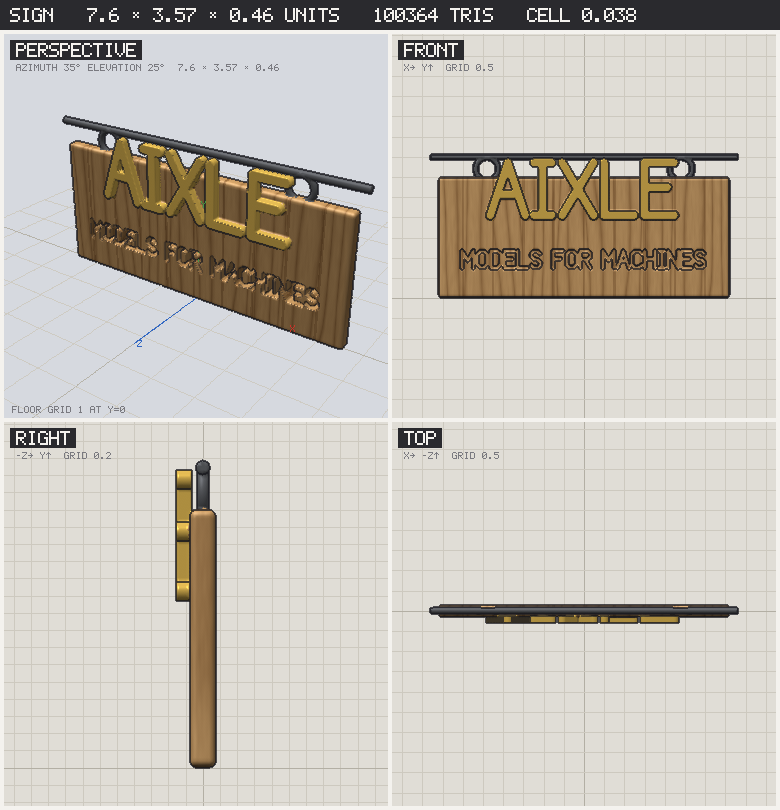

[program](https://github.com/tyevco/aixle/blob/main/examples/sign.aix) · <a href="/aixle/viewers/sign.html" target="_blank" rel="noopener">viewer</a>

### stairs

A spiral staircase: each step is placed by the loop index, lifted and

 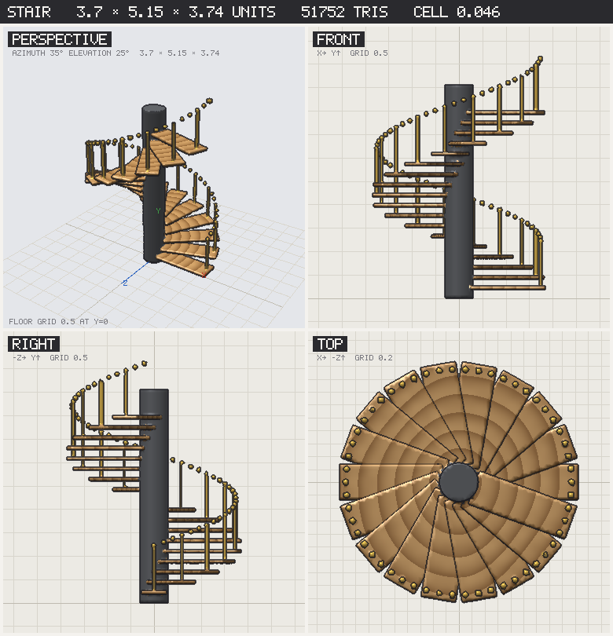

[program](https://github.com/tyevco/aixle/blob/main/examples/stairs.aix) · <a href="/aixle/viewers/stairs.html" target="_blank" rel="noopener">viewer</a>

### table

A table and four chairs. def makes a parametric chair; grid() and ring()

 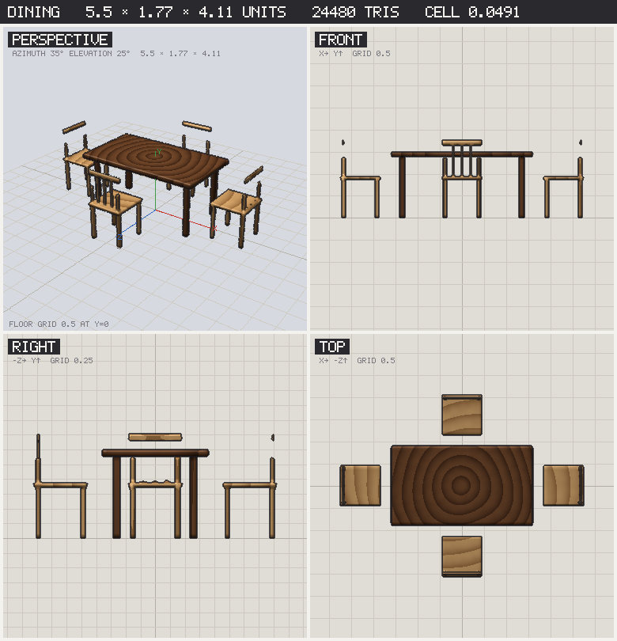

[program](https://github.com/tyevco/aixle/blob/main/examples/table.aix) · <a href="/aixle/viewers/table.html" target="_blank" rel="noopener">viewer</a>

### teapot

A teapot: a revolved body hollowed with shell() and opened at the top, a

 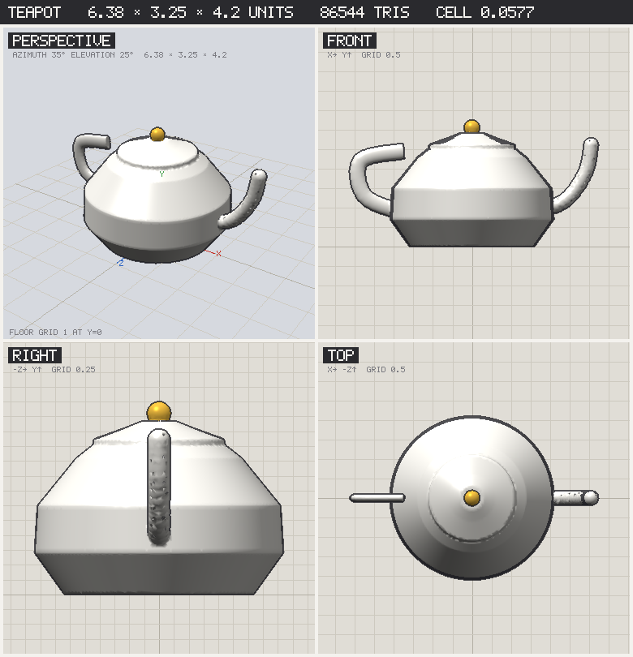

[program](https://github.com/tyevco/aixle/blob/main/examples/teapot.aix) · <a href="/aixle/viewers/teapot.html" target="_blank" rel="noopener">viewer</a>

### tower

A castle tower: a hollow drum with merlons round the top, arrow slits cut

 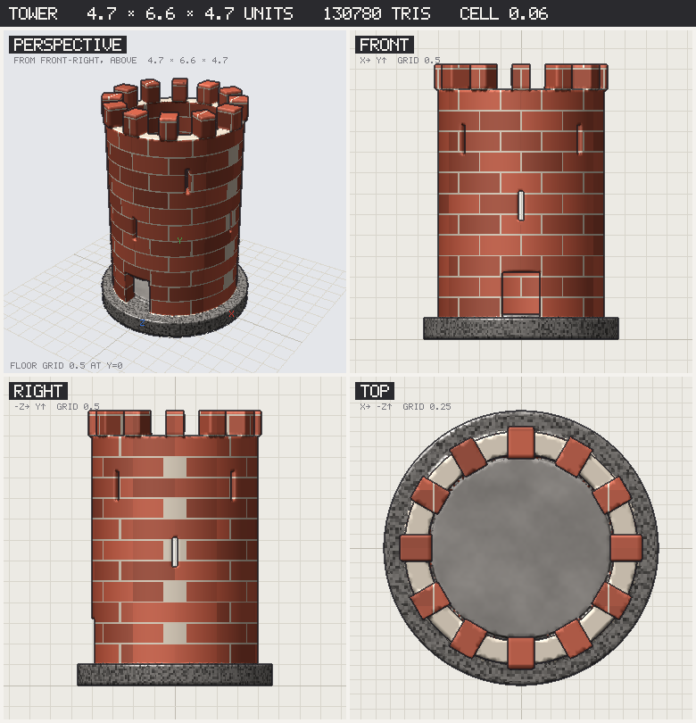

[program](https://github.com/tyevco/aixle/blob/main/examples/tower.aix) · <a href="/aixle/viewers/tower.html" target="_blank" rel="noopener">viewer</a>

### tree

A tree: a tapered, roughened trunk, three branches, and a canopy of

 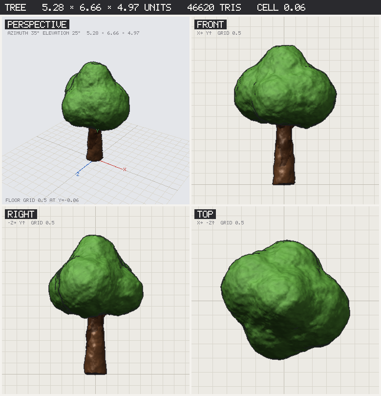

[program](https://github.com/tyevco/aixle/blob/main/examples/tree.aix) · <a href="/aixle/viewers/tree.html" target="_blank" rel="noopener">viewer</a>

### tumbler

A glass tumbler with a drink and a straw, for the beauty render's glass: the

 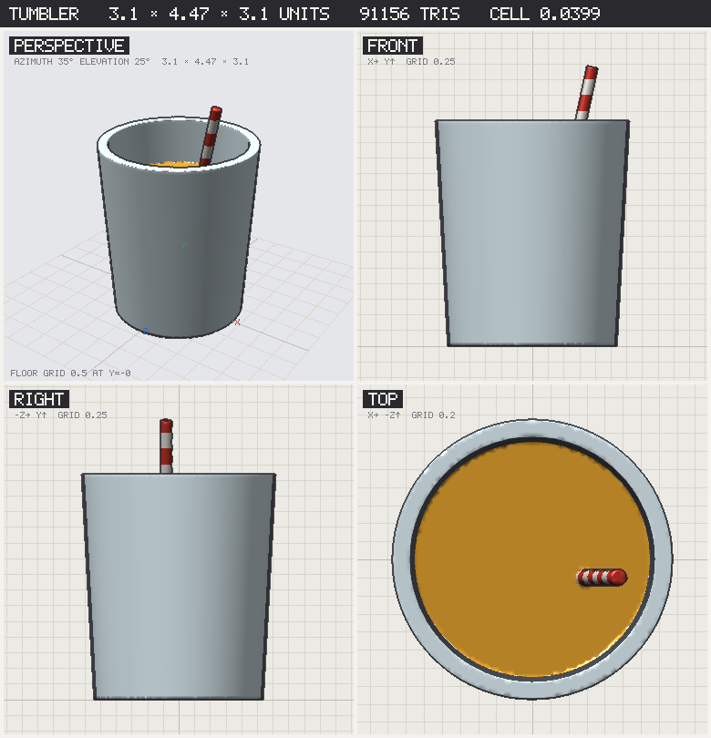

[program](https://github.com/tyevco/aixle/blob/main/examples/tumbler.aix) · <a href="/aixle/viewers/tumbler.html" target="_blank" rel="noopener">viewer</a>

### vase

A fluted vase: a lathe profile revolved around y, sixteen flutes cut from

 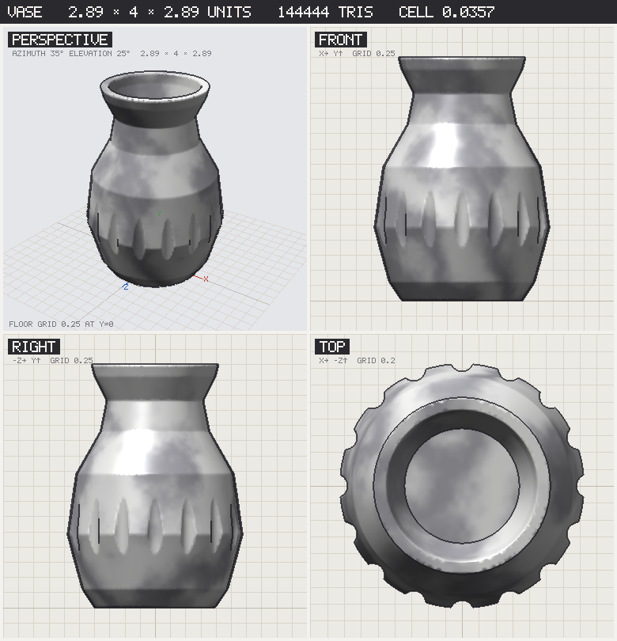

[program](https://github.com/tyevco/aixle/blob/main/examples/vase.aix) · <a href="/aixle/viewers/vase.html" target="_blank" rel="noopener">viewer</a>

## Dogfooding

Models built by fresh agents from the docs alone, kept as they wrote them, with their reports. See [the exercise](../dogfood/README.md).

### round-1_anglepoise

round 1: An anglepoise desk lamp. Unit: 1 = 10 cm. Front is +z; every hinge turns about x,

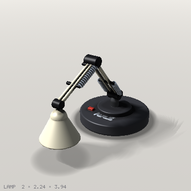 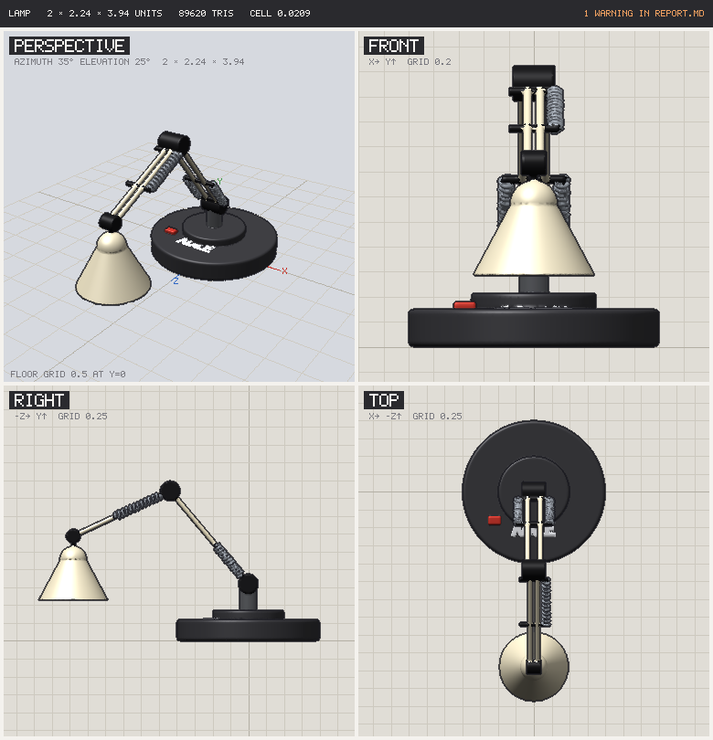

[program](https://github.com/tyevco/aixle/blob/main/dogfood/round-1/anglepoise.aix) · <a href="/aixle/viewers/round-1_anglepoise.html" target="_blank" rel="noopener">viewer</a> · [the agent's report](../dogfood/round-1/anglepoise.report.md)

### round-1_bench

round 1: A park bench: oak slats on two cast-iron end frames. Metres, y up,

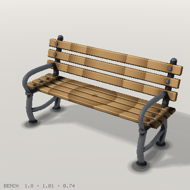 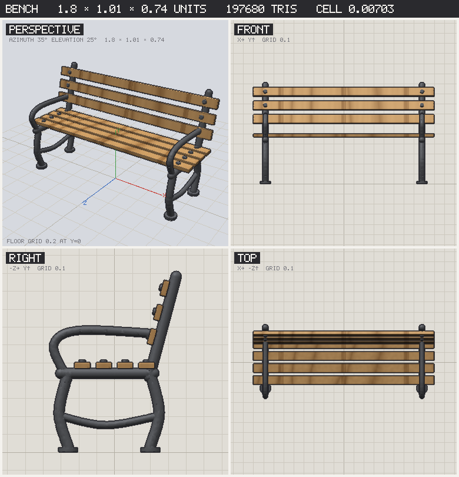

[program](https://github.com/tyevco/aixle/blob/main/dogfood/round-1/bench.aix) · <a href="/aixle/viewers/round-1_bench.html" target="_blank" rel="noopener">viewer</a> · [the agent's report](../dogfood/round-1/bench.report.md)

### round-1_lighthouse

round 1: A lighthouse on a rocky outcrop, with a keeper's cottage and a stone path.

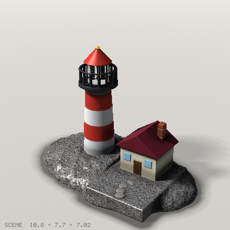 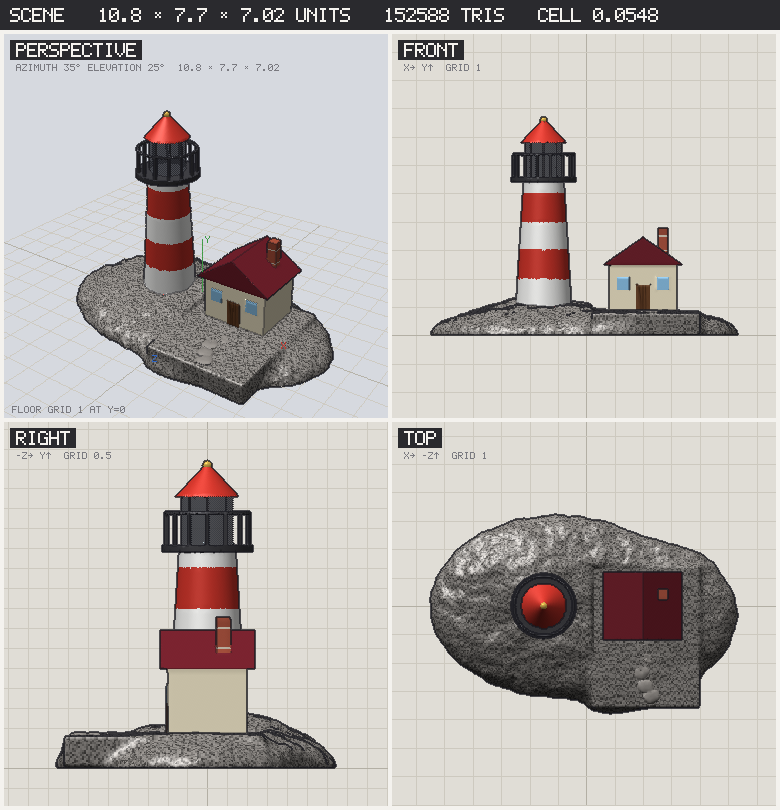

[program](https://github.com/tyevco/aixle/blob/main/dogfood/round-1/lighthouse.aix) · <a href="/aixle/viewers/round-1_lighthouse.html" target="_blank" rel="noopener">viewer</a> · [the agent's report](../dogfood/round-1/lighthouse.report.md)

### round-2_excavator

round 2: A hydraulic excavator: tracked base, a slewing upper structure, a bent

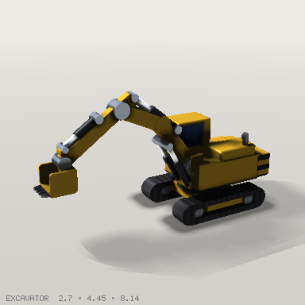 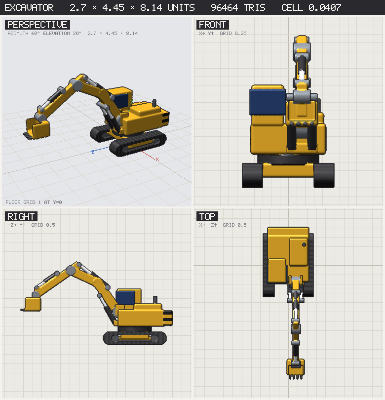

[program](https://github.com/tyevco/aixle/blob/main/dogfood/round-2/excavator.aix) · <a href="/aixle/viewers/round-2_excavator.html" target="_blank" rel="noopener">viewer</a> · [the agent's report](../dogfood/round-2/excavator.report.md)

### round-2_frog

round 2: A cartoon frog sitting on a lily pad. Front is +z. One unit ~ 10 cm; the frog is ~3 tall.

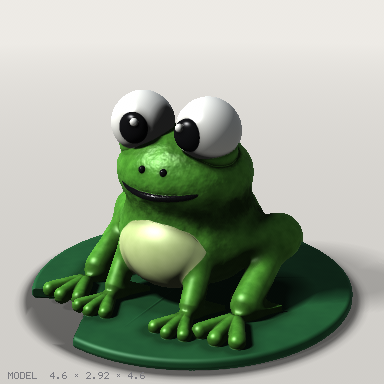 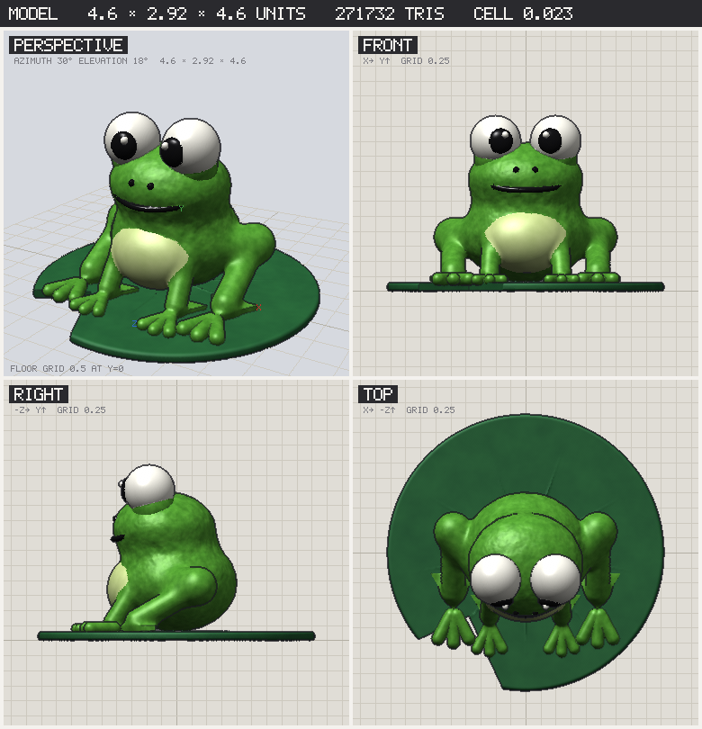

[program](https://github.com/tyevco/aixle/blob/main/dogfood/round-2/frog.aix) · <a href="/aixle/viewers/round-2_frog.html" target="_blank" rel="noopener">viewer</a> · [the agent's report](../dogfood/round-2/frog.report.md)

### round-2_market

round 2: A market stall. Front is +z, one unit is about 25 cm; the stall is 12

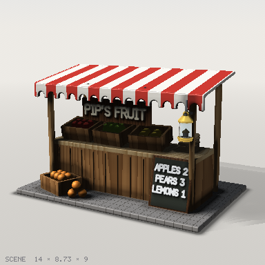 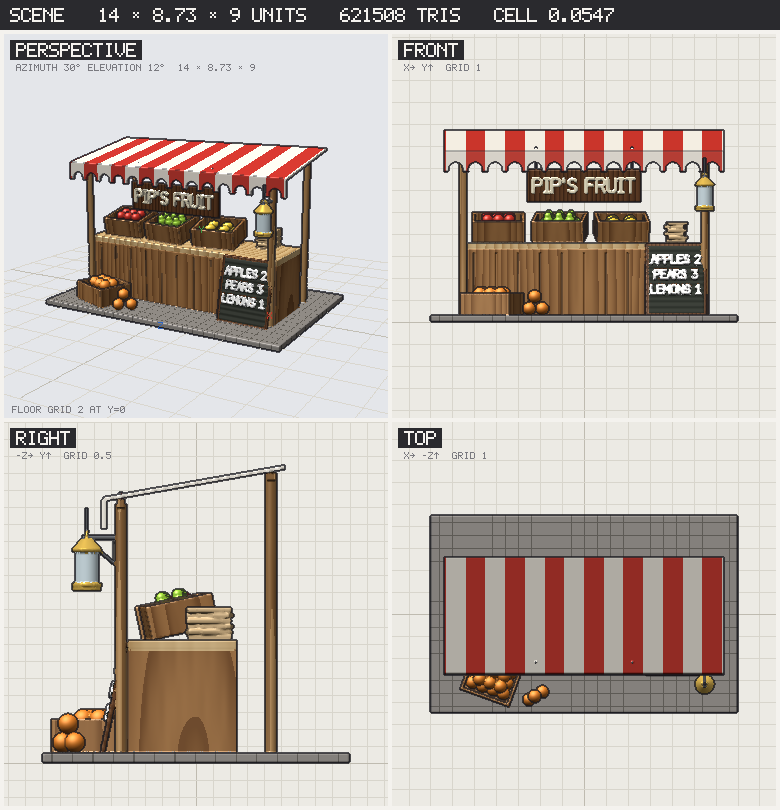

[program](https://github.com/tyevco/aixle/blob/main/dogfood/round-2/market.aix) · <a href="/aixle/viewers/round-2_market.html" target="_blank" rel="noopener">viewer</a> · [the agent's report](../dogfood/round-2/market.report.md)

### round-2_trophy

round 2: An award trophy, about 5 units tall, front on +z.

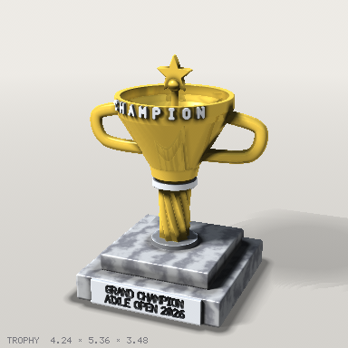 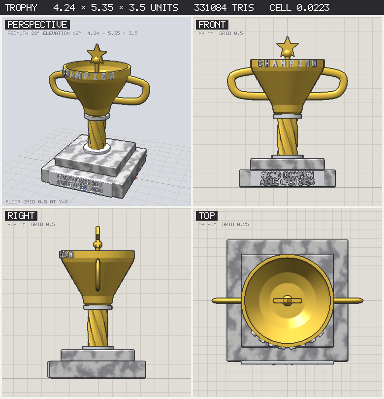

[program](https://github.com/tyevco/aixle/blob/main/dogfood/round-2/trophy.aix) · <a href="/aixle/viewers/round-2_trophy.html" target="_blank" rel="noopener">viewer</a> · [the agent's report](../dogfood/round-2/trophy.report.md)

### round-3_excavator

round 3: A hydraulic excavator on tracks. Front is +z; one unit is about a metre.

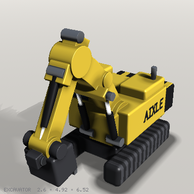 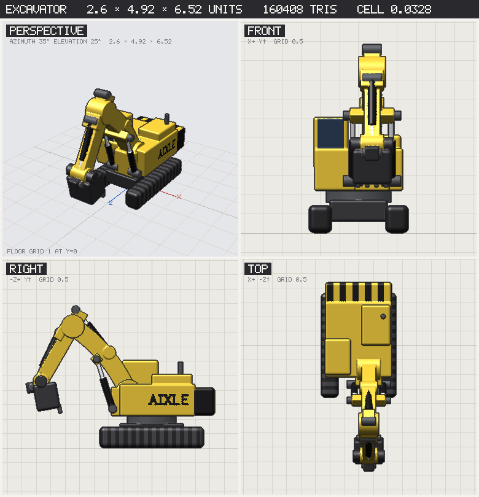

[program](https://github.com/tyevco/aixle/blob/main/dogfood/round-3/excavator.aix) · <a href="/aixle/viewers/round-3_excavator.html" target="_blank" rel="noopener">viewer</a> · [the agent's report](../dogfood/round-3/excavator.report.md)

### round-3_frog

round 3: A cartoon frog sitting on a lily pad. Front is +z. About 3 units tall.

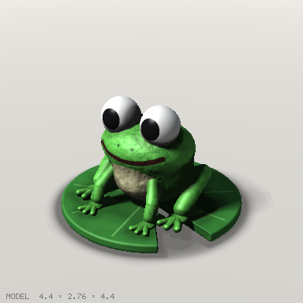 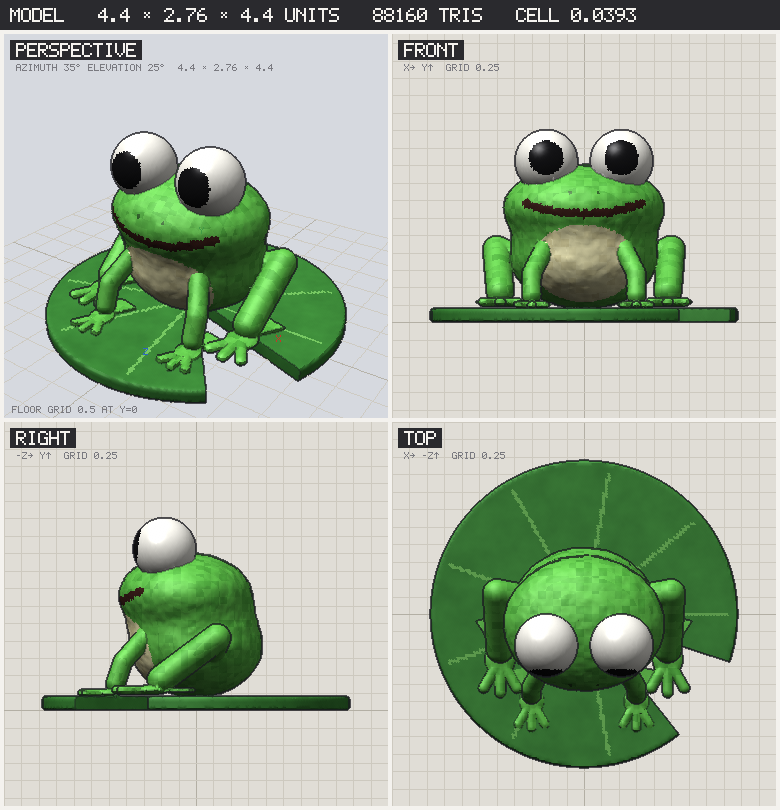

[program](https://github.com/tyevco/aixle/blob/main/dogfood/round-3/frog.aix) · <a href="/aixle/viewers/round-3_frog.html" target="_blank" rel="noopener">viewer</a> · [the agent's report](../dogfood/round-3/frog.report.md)

### round-3_market

round 3: A market stall, facing +z. One unit is about half a metre; the stall is

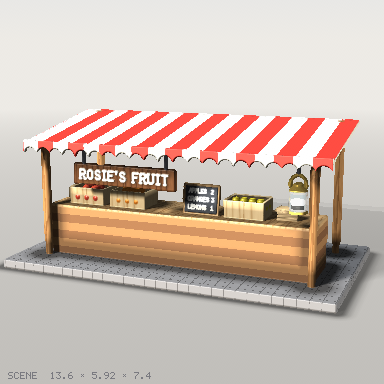 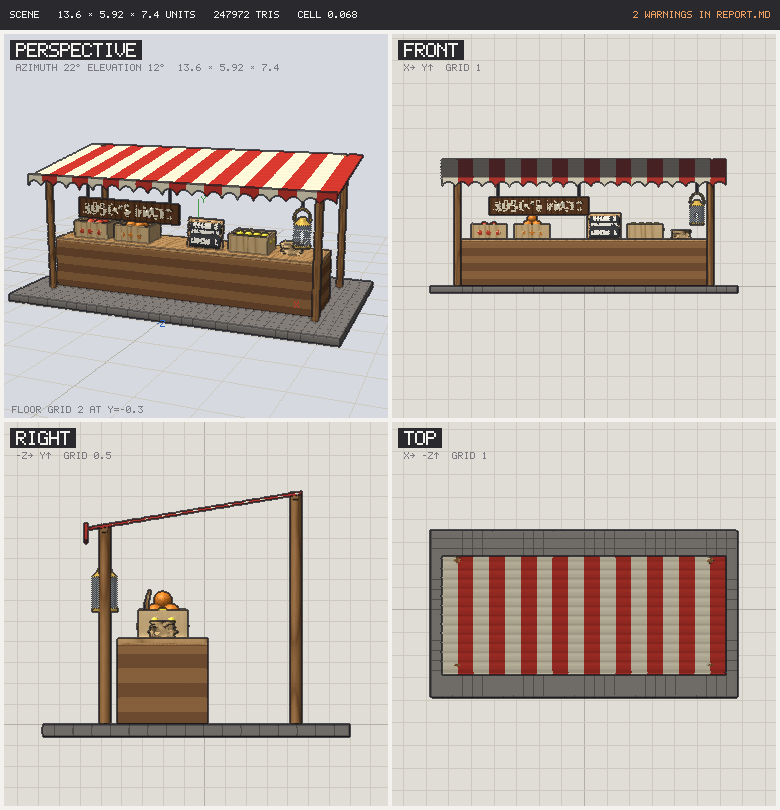

[program](https://github.com/tyevco/aixle/blob/main/dogfood/round-3/market.aix) · <a href="/aixle/viewers/round-3_market.html" target="_blank" rel="noopener">viewer</a> · [the agent's report](../dogfood/round-3/market.report.md)

### round-3_trophy

round 3: An award trophy, about 5 units tall, front on +z.

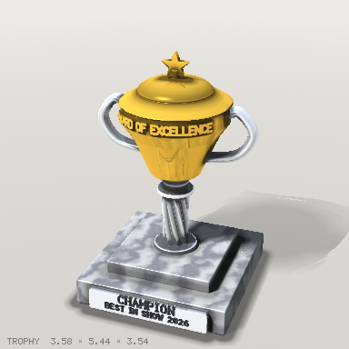 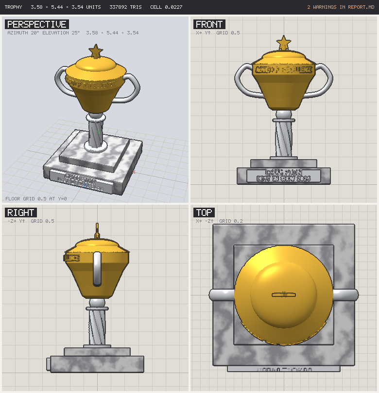

[program](https://github.com/tyevco/aixle/blob/main/dogfood/round-3/trophy.aix) · <a href="/aixle/viewers/round-3_trophy.html" target="_blank" rel="noopener">viewer</a> · [the agent's report](../dogfood/round-3/trophy.report.md)

### round-4_excavator

round 4: A hydraulic excavator on tracks. Front is +z; one unit is about a metre.

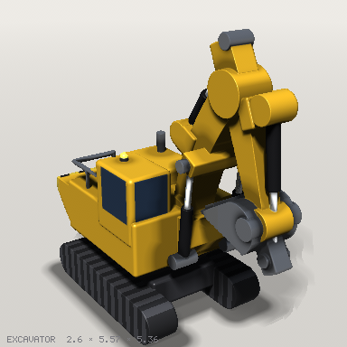 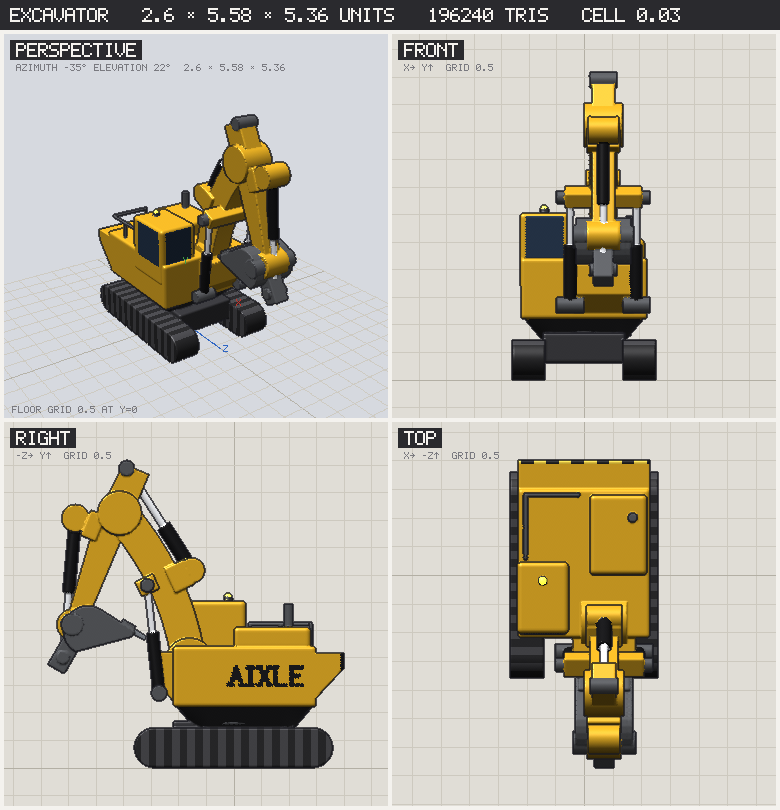

[program](https://github.com/tyevco/aixle/blob/main/dogfood/round-4/excavator.aix) · <a href="/aixle/viewers/round-4_excavator.html" target="_blank" rel="noopener">viewer</a> · [the agent's report](../dogfood/round-4/excavator.report.md)

### round-4_frog

round 4: A cartoon frog squatting on a notched lily pad, built to print in one piece.

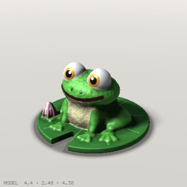 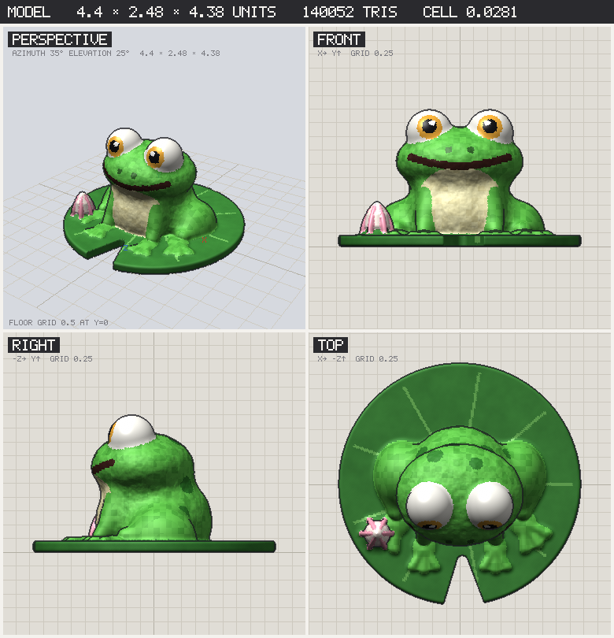

[program](https://github.com/tyevco/aixle/blob/main/dogfood/round-4/frog.aix) · <a href="/aixle/viewers/round-4_frog.html" target="_blank" rel="noopener">viewer</a> · [the agent's report](../dogfood/round-4/frog.report.md)

### round-4_market

round 4: ROSIE'S FRUIT: a market stall facing +z, built as ONE piece for printing.

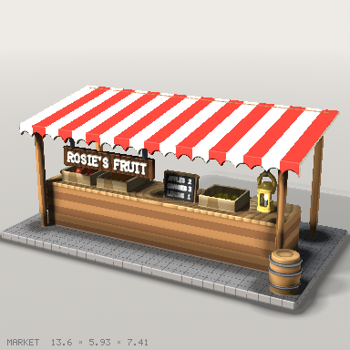 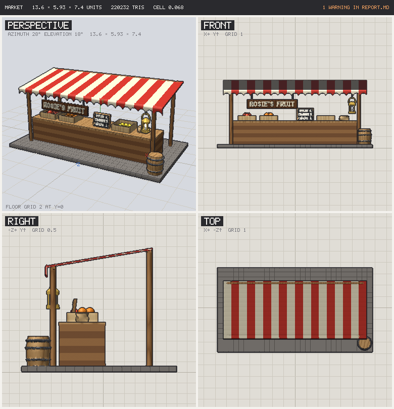

[program](https://github.com/tyevco/aixle/blob/main/dogfood/round-4/market.aix) · <a href="/aixle/viewers/round-4_market.html" target="_blank" rel="noopener">viewer</a> · [the agent's report](../dogfood/round-4/market.report.md)

### round-4_trophy

round 4: An award trophy, about 6.3 units tall, front on +z, one solid piece for printing.

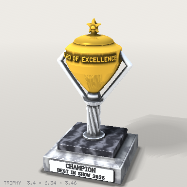 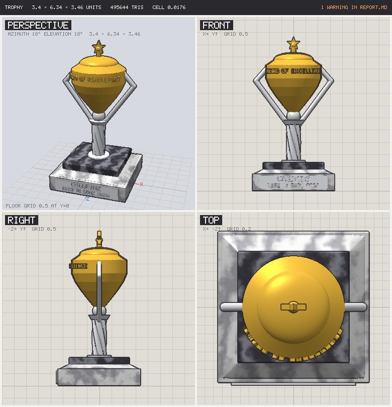

[program](https://github.com/tyevco/aixle/blob/main/dogfood/round-4/trophy.aix) · <a href="/aixle/viewers/round-4_trophy.html" target="_blank" rel="noopener">viewer</a> · [the agent's report](../dogfood/round-4/trophy.report.md)
